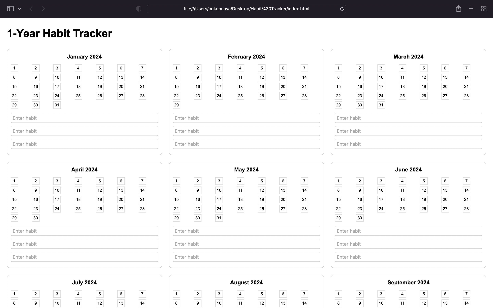

# 1-Year Habit Tracker

This project is a simple and interactive habit tracker designed to help users track their daily habits for an entire year. Users can set up to three habits for each month and mark their progress day by day.

## Features
- Displays a full calendar for the year, divided by months.
- Users can customize up to three habits for each month by entering their habit names in the provided input fields.
- Interactive design where users can visually track daily progress.
- Lightweight and easy to use, built entirely with HTML, CSS, and JavaScript.

## Link to HTML file
Check it out here [habit-tracker.html](index.html) Feel free to clone this repository or the codes used.

## Live Demo
If you have GitHub Pages enabled for this repository, you can view the live demo at:
```[
https://cokonnaya.github.io/Habit-Tracker/
```
## How to Use
1. Open in your web browser to start using the tracker.
2. Type your desired habits in the provided input boxes for each month.
3. Track your progress by referring to the calendar days.

## Screenshots



## Technologies Used
- **HTML**: For structuring the layout.
- **CSS**: For styling the calendar and input fields.
- **JavaScript**: For dynamically generating the months and days.

## Contributing
Contributions are welcome! If you have ideas for improving the tracker, feel free to submit a pull request.

## License
This project is licensed under the [MIT License](LICENSE).
```
